# Q20 (analysis)

**Q:** For these TCGA cohorts and their tissues of origin: liver hepatocellular carcinoma (liver), kidney renal clear cell carcinoma (kidney), pancreatic adenocarcinoma (pancreas), lung adenocarcinoma (lung), breast invasive carcinoma (breast), colon adenocarcinoma (colon), stomach adenocarcinoma (stomach), prostate adenocarcinoma (prostate), ovary serous cystadenocarcinoma (ovary), thyroid carcinoma (thyroid gland), glioblastoma multiforme (brain), testicular germ cell tumor (testis): give the number of validated favourable and validated unfavourable prognostic genes, and how many of each are tissue enriched in the tissue of origin. Draw a grouped bar chart of the four counts per cohort and provide the table.

**gpt-5.6-luna, reasoning effort low:**

Using the HPA TCGA prognostic data, I counted a gene as **validated favourable/unfavourable** when the corresponding validated prognostic field was populated. A gene was counted as **tissue enriched in the tissue of origin** when:

- HPA RNA tissue specificity was exactly **“Tissue enriched”**, and
- the tissue of origin appeared in HPA’s **RNA tissue-specific nTPM** field.

| TCGA cohort | Tissue of origin | Validated favourable | Of which tissue enriched | Validated unfavourable | Of which tissue enriched |
|---|---:|---:|---:|---:|---:|
| Liver hepatocellular carcinoma | Liver | 113 | 45 | 939 | 0 |
| Kidney renal clear cell carcinoma | Kidney | 1,639 | 16 | 264 | 0 |
| Pancreatic adenocarcinoma | Pancreas | 4 | 0 | 134 | 0 |
| Lung adenocarcinoma | Lung | 5 | 0 | 202 | 0 |
| Breast invasive carcinoma | Breast | 5 | 0 | 4 | 0 |
| Colon adenocarcinoma | Colon | 5 | 0 | 3 | 0 |
| Stomach adenocarcinoma | Stomach | 0 | 0 | 0 | 0 |
| Prostate adenocarcinoma | Prostate | 0 | 0 | 0 | 0 |
| Ovary serous cystadenocarcinoma | Ovary | 0 | 0 | 17 | 0 |
| Thyroid carcinoma | Thyroid gland | 0 | 0 | 0 | 0 |
| Glioblastoma multiforme | Brain | 12 | 0 | 57 | 0 |
| Testicular germ cell tumor | Testis | 0 | 0 | 0 | 0 |

### Grouped bar chart

The tissue-enriched counts are shown as separate bars, including zero values.

```mermaid
xychart-beta
    title "Validated prognostic genes and tissue-enriched subsets"
    x-axis ["LIHC","KIRC","PAAD","LUAD","BRCA","COAD","STAD","PRAD","OV","THCA","GBM","TGCT"]
    y-axis "Number of genes" 0 --> 1700
    bar "Validated favourable" [113,1639,4,5,5,5,0,0,0,0,12,0]
    bar "Favourable, tissue enriched" [45,16,0,0,0,0,0,0,0,0,0,0]
    bar "Validated unfavourable" [939,264,134,202,4,3,0,0,17,0,57,0]
    bar "Unfavourable, tissue enriched" [0,0,0,0,0,0,0,0,0,0,0,0]
```

The HPA data therefore show tissue-enriched validated prognostic genes only among the favourable group for these selected cohorts: **45 in liver hepatocellular carcinoma** and **16 in kidney renal clear cell carcinoma**.

---
model calls 7, tool calls 9, tokens in 51356 (cached 39867) out 3476 (reasoning 406), 68.4 s, cost $0.0152, stop completed
