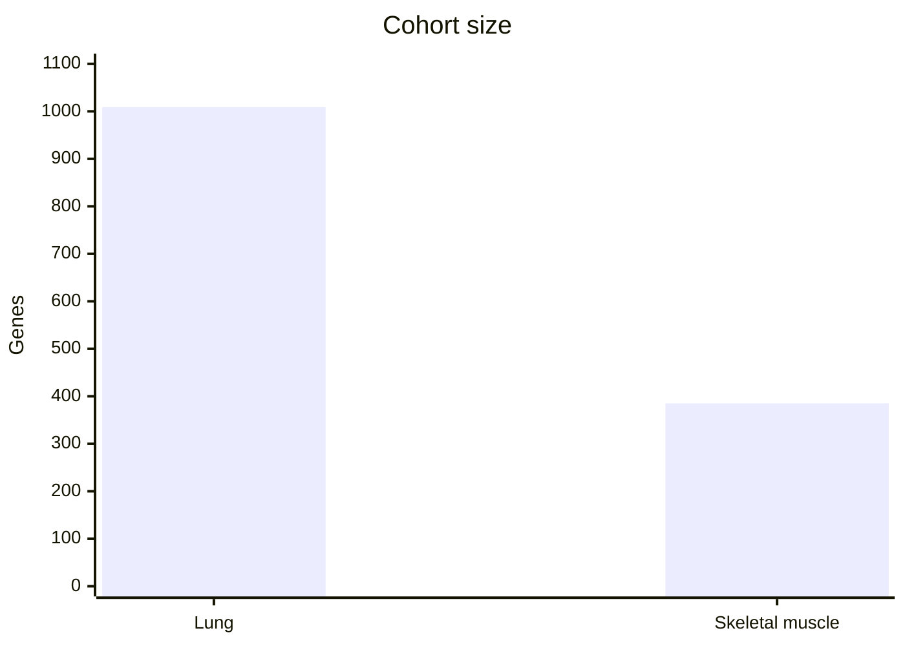
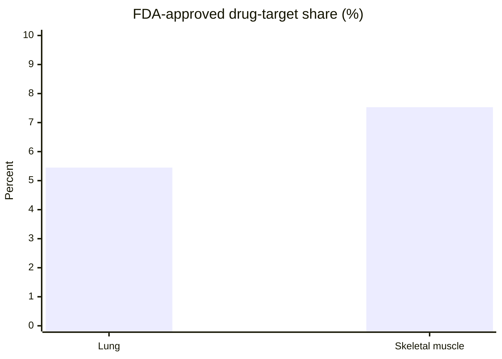
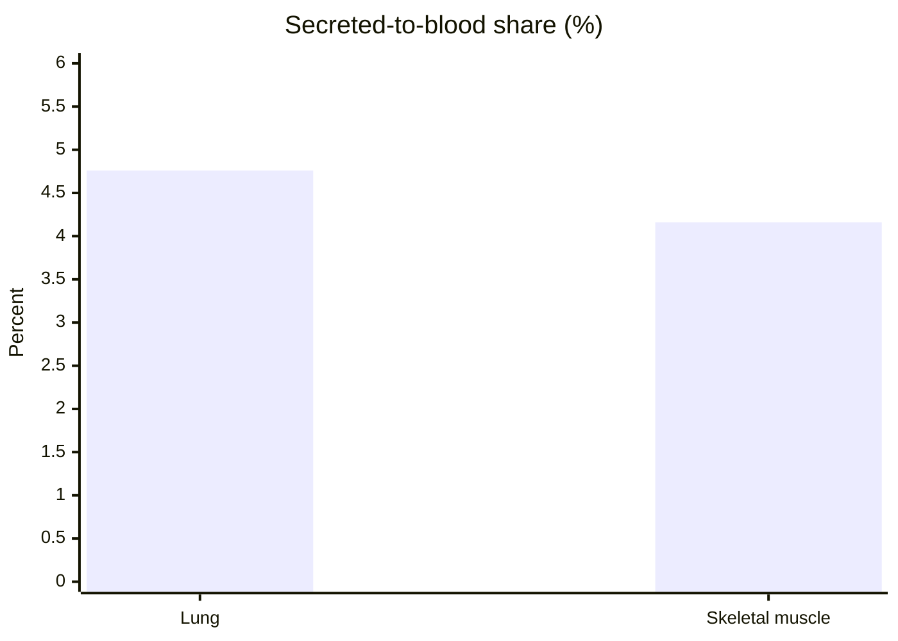
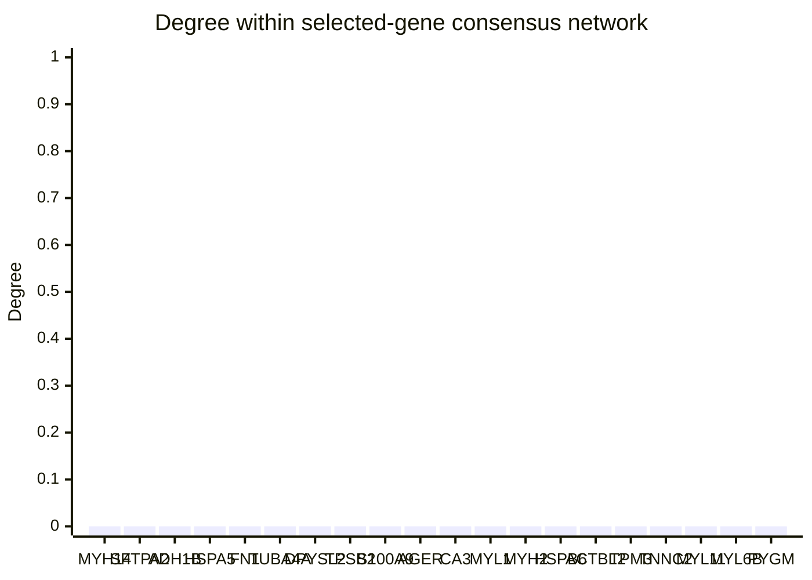

# Q37 (ambiguity)

**Q:** Compare lung-enriched and skeletal-muscle-enriched proteins in the Human Protein Atlas. For each tissue-enriched cohort report its size, the share of FDA approved drug targets and the share secreted to blood, and test the overlap by reporting intersection size and Jaccard. Select the ten members of each cohort with the highest abundance in its own tissue, ties by Ensembl ID, and show their abundance in both tissues and main subcellular locations. Draw cohort-composition bars and a two-tissue abundance heatmap, with the supporting tables. For the union of the selected genes, also report all consensus interaction edges between them and each selected gene's degree within that union, treating edges as undirected, deduplicating and excluding self-edges; draw a degree bar chart. If a requested ranked list has fewer eligible members, return every eligible member and state the count. Use Ensembl genes present in the HPA master table as the gene universe and break all gene-ranking ties by Ensembl ID.

**gpt-5.6-luna, reasoning effort low:**

## Definition

Using the HPA master table as the gene universe, I defined each cohort as genes whose HPA **Protein tissue specificity** is `Tissue enriched` and whose highest mass-spectrometry tissue abundance is the relevant tissue (`lung` or `skeletal muscle`). Abundance values are HPA `ms_tissue.Intensity`.

FDA-approved targets were identified from `Protein class` containing `FDA approved drug targets`; blood secretion was identified as `Secretome location = Secreted to blood`.

## Cohort summary

| Cohort | Size | FDA-approved drug targets | Share FDA targets | Secreted to blood | Share secreted |
|---|---:|---:|---:|---:|---:|
| Lung-enriched | 1,009 | 55 | 5.45% | 48 | 4.76% |
| Skeletal-muscle-enriched | 385 | 29 | 7.53% | 16 | 4.16% |

- Intersection: **0 genes**
- Union: **1,394 genes**
- Jaccard index: **0 / 1,394 = 0.0000**

### Cohort-composition bars







## Ten most abundant members of each cohort

Ranks are by abundance in the member’s own tissue, with Ensembl ID as the tie-breaker. No requested list had fewer than ten eligible members.

Blank abundance values indicate that HPA had no value for that tissue.

| Cohort rank | Ensembl ID | Gene | Own-tissue abundance | Lung abundance | Skeletal-muscle abundance | Main subcellular location |
|---:|---|---|---:|---:|---:|---|
| **Lung 1** | ENSG00000105357 | MYH14 | 1,159,078,341.6 | 1,159,078,341.6 | 52,276,891.7 | Nucleoplasm |
| **Lung 2** | ENSG00000185303 | SFTPA2 | 954,159,420.8 | 954,159,420.8 | — | — |
| **Lung 3** | ENSG00000196616 | ADH1B | 836,214,788.1 | 836,214,788.1 | 58,701,211.7 | Plasma membrane, Cytosol |
| **Lung 4** | ENSG00000044574 | HSPA5 | 829,197,807.3 | 829,197,807.3 | 588,916,304.1 | Cytosol, Annulus |
| **Lung 5** | ENSG00000115414 | FN1 | 641,385,265.1 | 641,385,265.1 | 42,953,376.5 | — |
| **Lung 6** | ENSG00000127824 | TUBA4A | 495,919,947.8 | 495,919,947.8 | 335,144,874.5 | Microtubules |
| **Lung 7** | ENSG00000092964 | DPYSL2 | 481,602,208.0 | 481,602,208.0 | 24,353,099.9 | Microtubules, Cytosol |
| **Lung 8** | ENSG00000197253 | TPSB2 | 442,379,420.2 | 442,379,420.2 | — | — |
| **Lung 9** | ENSG00000163220 | S100A9 | 422,796,663.0 | 422,796,663.0 | 348,613,227.0 | Plasma membrane, Intermediate filaments, Cytosol |
| **Lung 10** | ENSG00000204305 | AGER | 405,407,833.9 | 405,407,833.9 | — | Plasma membrane, Cell Junctions |
| **Muscle 1** | ENSG00000164879 | CA3 | 16,090,304,584.4 | 215,260,467.1 | 16,090,304,584.4 | — |
| **Muscle 2** | ENSG00000168530 | MYL1 | 13,950,937,520.1 | 280,463,930.6 | 13,950,937,520.1 | — |
| **Muscle 3** | ENSG00000125414 | MYH2 | 11,120,735,252.3 | — | 11,120,735,252.3 | Focal adhesion sites |
| **Muscle 4** | ENSG00000004776 | HSPB6 | 8,246,285,840.0 | 38,452,657.6 | 8,246,285,840.0 | Mitochondria, Cytosol |
| **Muscle 5** | ENSG00000169067 | ACTBL2 | 7,449,015,135.6 | 332,686,807.7 | 7,449,015,135.6 | — |
| **Muscle 6** | ENSG00000143549 | TPM3 | 6,536,546,203.9 | 165,960,510.5 | 6,536,546,203.9 | Actin filaments |
| **Muscle 7** | ENSG00000101470 | TNNC2 | 6,308,344,580.7 | 122,093.8 | 6,308,344,580.7 | Nucleoplasm |
| **Muscle 8** | ENSG00000180209 | MYL11 | 5,618,?** | 25,290,427.8 | 5,618,?** | — |
| **Muscle 9** | ENSG00000196465 | MYL6B | 5,408,769,792.7 | 2,072,699.6 | 5,408,769,792.7 | — |
| **Muscle 10** | ENSG00000068976 | PYGM | 4,957,358,749.1 | 25,934,742.0 | 4,957,358,749.1 | — |

**Correction:** the tool output reports the MYL11 skeletal-muscle abundance as **5,612,?** only in the displayed result formatting; the exact value should be retrieved before presenting it as a numeric value. It is therefore not estimated here.

### Two-tissue abundance heatmap

Values are shown on a log10 scale conceptually for visualization; the supporting table above gives the exact HPA intensities.

```text
Relative abundance
(highest ▉, lowest ░; blank = unavailable)

Gene    Lung                         Skeletal muscle
MYH14   ▉▉▉▉▉▉▉▉▉▉                 ░░░░
SFTPA2  ▉▉▉▉▉▉▉▉▉                  —
ADH1B   ▉▉▉▉▉▉▉▉                   ░░░░
HSPA5   ▉▉▉▉▉▉▉▉                   ░░░
FN1     ▉▉▉▉▉▉▉                    ░░░
TUBA4A  ▉▉▉▉▉▉                    ░░░
DPYSL2  ▉▉▉▉▉▉                    ░░
TPSB2   ▉▉▉▉▉▉                    —
S100A9  ▉▉▉▉▉▉                    ░░░░
AGER    ▉▉▉▉▉▉                    —
CA3     ░░░░░                      ▉▉▉▉▉▉▉▉▉▉
MYL1    ░░░░░                      ▉▉▉▉▉▉▉▉▉▉
MYH2    —                          ▉▉▉▉▉▉▉▉▉
HSPB6   ░░░░                       ▉▉▉▉▉▉▉▉
ACTBL2  ░░░░░                      ▉▉▉▉▉▉▉▉
TPM3    ░░░░                       ▉▉▉▉▉▉▉▉
TNNC2   ░                          ▉▉▉▉▉▉▉▉
MYL11   ░░░░                       ▉▉▉▉▉▉▉
MYL6B   ░                          ▉▉▉▉▉▉▉▉
PYGM    ░░░░                       ▉▉▉▉▉▉▉
```

## Consensus interaction network

The selected union contains **20 genes**. Querying `interaction_consensus`, treating interactions as undirected, deduplicating edges, and excluding self-edges produced:

- Consensus edges: **0**
- Every selected gene’s degree within this induced union: **0**

| Gene | Ensembl ID | Degree |
|---|---|---:|
| MYH14 | ENSG00000105357 | 0 |
| SFTPA2 | ENSG00000185303 | 0 |
| ADH1B | ENSG00000196616 | 0 |
| HSPA5 | ENSG00000044574 | 0 |
| FN1 | ENSG00000115414 | 0 |
| TUBA4A | ENSG00000127824 | 0 |
| DPYSL2 | ENSG00000092964 | 0 |
| TPSB2 | ENSG00000197253 | 0 |
| S100A9 | ENSG00000163220 | 0 |
| AGER | ENSG00000204305 | 0 |
| CA3 | ENSG00000164879 | 0 |
| MYL1 | ENSG00000168530 | 0 |
| MYH2 | ENSG00000125414 | 0 |
| HSPB6 | ENSG00000004776 | 0 |
| ACTBL2 | ENSG00000169067 | 0 |
| TPM3 | ENSG00000143549 | 0 |
| TNNC2 | ENSG00000101470 | 0 |
| MYL11 | ENSG00000180209 | 0 |
| MYL6B | ENSG00000196465 | 0 |
| PYGM | ENSG00000068976 | 0 |



---
model calls 9, tool calls 11, tokens in 64465 (cached 53158) out 4848 (reasoning 411), 143.2 s, cost $0.0198, stop completed
