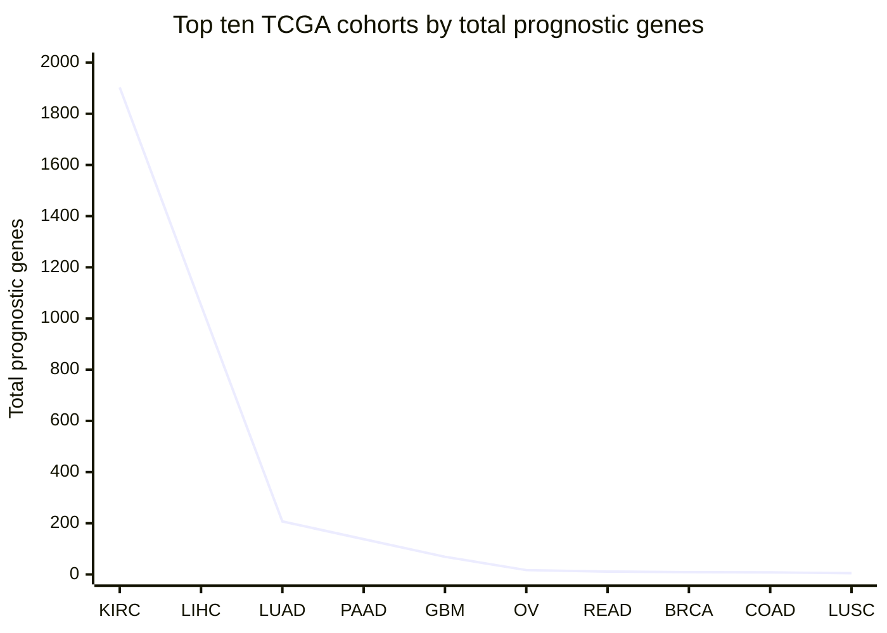

# Q7 (analysis)

**Q:** For the TCGA cancer cohorts in the HPA cancer prognostics, give a grouped bar chart of the number of validated favourable versus validated unfavourable prognostic genes per cancer, a dot plot of the ten cancers with the most prognostic genes in total, and the table behind both.

**gpt-5.6-luna, reasoning effort low:**

## TCGA cancer prognostics

Counts represent **distinct genes** with a non-empty HPA value in either validated prognostic field:

- **Favourable:** `validated prognostic - favorable`
- **Unfavourable:** `validated prognostic - unfavorable`
- **Total:** union of the two sets; a gene present in both categories is counted once.

### 1. Grouped bar chart

Abbreviations:  
BLCA = Bladder; BRCA = Breast; CESC = Cervical; COAD = Colon; GBM = Glioblastoma; HNSC = Head and Neck; KICH = Kidney Chromophobe; KIRC = Kidney Clear Cell; KIRP = Kidney Papillary; LIHC = Liver; LUAD = Lung Adenocarcinoma; LUSC = Lung Squamous; OV = Ovary; PAAD = Pancreas; PRAD = Prostate; READ = Rectum; SKCM = Skin; STAD = Stomach; TGCT = Testicular; THCA = Thyroid; UCEC = Uterine.

```mermaid
xychart-beta
    title "Validated prognostic genes in TCGA cohorts"
    x-axis ["KIRC","LIHC","LUAD","PAAD","GBM","OV","READ","BRCA","COAD","LUSC","BLCA","CESC","HNSC","KICH","KIRP","PRAD","SKCM","STAD","TGCT","THCA","UCEC"]
    y-axis "Number of genes" 0 --> 1700
    bar [1639,113,5,4,12,0,11,5,5,1,0,0,0,0,0,0,0,0,0,0,0]
    bar [264,939,202,134,57,17,0,4,3,4,0,0,0,0,0,0,0,0,0,0,0]
```

**Series order:** favourable, then unfavourable.

### 2. Dot plot: ten cancers with the most prognostic genes

Each point/value is the total number of distinct genes with at least one validated favourable or validated unfavourable prognostic annotation.

### 3. Table behind the charts

| Rank by total | TCGA cancer cohort | Validated favourable | Validated unfavourable | Total |
|---:|---|---:|---:|---:|
| 1 | Kidney Renal Clear Cell Carcinoma | 1,639 | 264 | 1,903 |
| 2 | Liver Hepatocellular Carcinoma | 113 | 939 | 1,052 |
| 3 | Lung Adenocarcinoma | 5 | 202 | 207 |
| 4 | Pancreatic Adenocarcinoma | 4 | 134 | 138 |
| 5 | Glioblastoma Multiforme | 12 | 57 | 69 |
| 6 | Ovary Serous Cystadenocarcinoma | 0 | 17 | 17 |
| 7 | Rectum Adenocarcinoma | 11 | 0 | 11 |
| 8 | Breast Invasive Carcinoma | 5 | 4 | 9 |
| 9 | Colon Adenocarcinoma | 5 | 3 | 8 |
| 10 | Lung Squamous Cell Carcinoma | 1 | 4 | 5 |
| 11 | Bladder Urothelial Carcinoma | 0 | 0 | 0 |
| 12 | Cervical Squamous Cell Carcinoma and Endocervical Adenocarcinoma | 0 | 0 | 0 |
| 13 | Head and Neck Squamous Cell Carcinoma | 0 | 0 | 0 |
| 14 | Kidney Chromophobe | 0 | 0 | 0 |
| 15 | Kidney Renal Papillary Cell Carcinoma | 0 | 0 | 0 |
| 16 | Prostate Adenocarcinoma | 0 | 0 | 0 |
| 17 | Skin Cuteneous Melanoma | 0 | 0 | 0 |
| 18 | Stomach Adenocarcinoma | 0 | 0 | 0 |
| 19 | Testicular Germ Cell Tumor | 0 | 0 | 0 |
| 20 | Thyroid Carcinoma | 0 | 0 | 0 |
| 21 | Uterine Corpus Endometrial Carcinoma | 0 | 0 | 0 |

Note: The total is a union count, so it is not necessarily the arithmetic sum of the two directional counts if a gene has both validated annotations.

---
model calls 4, tool calls 4, tokens in 19560 (cached 12200) out 1767 (reasoning 376), 51.6 s, cost $0.0063, stop completed
