# Q20 (analysis)

**Q:** For these TCGA cohorts and their tissues of origin: liver hepatocellular carcinoma (liver), kidney renal clear cell carcinoma (kidney), pancreatic adenocarcinoma (pancreas), lung adenocarcinoma (lung), breast invasive carcinoma (breast), colon adenocarcinoma (colon), stomach adenocarcinoma (stomach), prostate adenocarcinoma (prostate), ovary serous cystadenocarcinoma (ovary), thyroid carcinoma (thyroid gland), glioblastoma multiforme (brain), testicular germ cell tumor (testis): give the number of validated favourable and validated unfavourable prognostic genes, and how many of each are tissue enriched in the tissue of origin. Draw a grouped bar chart of the four counts per cohort and provide the table.

**gpt-5.6-terra, reasoning effort low:**

## Validated prognostic genes and tissue-of-origin enrichment

“Tissue enriched” was counted when the gene is classified by HPA as **RNA tissue specificity = Tissue enriched** and its highest consensus RNA expression is in the stated tissue of origin. For **brain**, the HPA brain-region tissues were treated as brain tissue.

| TCGA cohort | Tissue of origin | Validated favourable | Favourable, tissue-enriched in origin | Validated unfavourable | Unfavourable, tissue-enriched in origin |
|---|---|---:|---:|---:|---:|
| Liver hepatocellular carcinoma | liver | 113 | 45 | 939 | 0 |
| Kidney renal clear cell carcinoma | kidney | 1,639 | 16 | 264 | 0 |
| Pancreatic adenocarcinoma | pancreas | 4 | 0 | 134 | 0 |
| Lung adenocarcinoma | lung | 5 | 0 | 202 | 0 |
| Breast invasive carcinoma | breast | 5 | 0 | 4 | 0 |
| Colon adenocarcinoma | colon | 5 | 0 | 3 | 0 |
| Stomach adenocarcinoma | stomach | 0 | 0 | 0 | 0 |
| Prostate adenocarcinoma | prostate | 0 | 0 | 0 | 0 |
| Ovary serous cystadenocarcinoma | ovary | 0 | 0 | 17 | 0 |
| Thyroid carcinoma | thyroid gland | 0 | 0 | 0 | 0 |
| Glioblastoma multiforme | brain | 12 | 0 | 57 | 0 |
| Testicular germ cell tumor | testis | 0 | 0 | 0 | 0 |

```mermaid
xychart-beta
    title "Validated prognostic genes and tissue-of-origin enriched subsets"
    x-axis ["LIHC","KIRC","PAAD","LUAD","BRCA","COAD","STAD","PRAD","OV","THCA","GBM","TGCT"]
    y-axis "Number of genes" 0 --> 1700
    bar "Validated favourable" [113, 1639, 4, 5, 5, 5, 0, 0, 0, 0, 12, 0]
    bar "Favourable—origin tissue enriched" [45, 16, 0, 0, 0, 0, 0, 0, 0, 0, 0, 0]
    bar "Validated unfavourable" [939, 264, 134, 202, 4, 3, 0, 0, 17, 0, 57, 0]
    bar "Unfavourable—origin tissue enriched" [0, 0, 0, 0, 0, 0, 0, 0, 0, 0, 0, 0]
```

**Abbreviations:** LIHC, liver hepatocellular carcinoma; KIRC, kidney renal clear cell carcinoma; PAAD, pancreatic adenocarcinoma; LUAD, lung adenocarcinoma; BRCA, breast invasive carcinoma; COAD, colon adenocarcinoma; STAD, stomach adenocarcinoma; PRAD, prostate adenocarcinoma; OV, ovary serous cystadenocarcinoma; THCA, thyroid carcinoma; GBM, glioblastoma multiforme; TGCT, testicular germ cell tumor.

---
model calls 7, tool calls 8, tokens in 112483 (cached 85722) out 3337 (reasoning 1137), 95.9 s, cost $0.2822, stop completed
