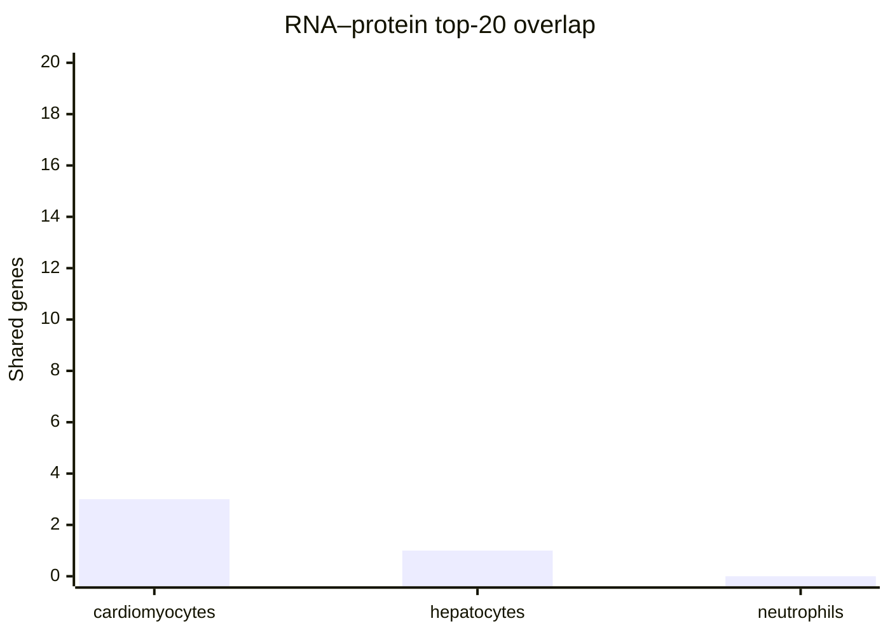

# Q30 (analysis)

**Q:** Assess RNA-protein agreement for cardiomyocytes, hepatocytes and neutrophils in the Human Protein Atlas using single-cell-type RNA nCPM and Deep Visual Proteomics cell-type Intensity. Join by Ensembl ID and those exact cell-type names. For each cell type separately retain genes with positive measurements in both modalities, report the retained count, Spearman correlation and overlap/Jaccard of the top twenty genes ranked independently by RNA and by protein. Give the top-twenty lists with values. Convert within-cell-type ranks to percentiles (ascending average rank divided by retained count), and select five genes per cell type with the largest absolute RNA-minus-protein percentile difference, ties by Ensembl ID. Give their measurements, percentiles and main subcellular locations. Draw three RNA/protein scatter panels restricted to the union of each cell type's two top-twenty lists, a top-twenty-overlap bar chart and a discordance heatmap. Supply the top-list union measurements and the aggregate and discordant-gene tables. If a requested ranked list has fewer eligible members, return every eligible member and state the count. Use Ensembl genes present in the HPA master table as the gene universe and break all gene-ranking ties by Ensembl ID.

**gpt-5.6-terra, reasoning effort low:**

## Method

I used the HPA master-table Ensembl IDs as the universe, joined `rna_single_cell_type` to `dvp_cell_type` on Ensembl ID and the exact available HPA cell-type strings (`cardiomyocytes`, `hepatocytes`, `neutrophils`), then retained only genes with RNA nCPM > 0 and DVP Intensity > 0. Rankings are descending measurement with Ensembl ID as the tie-breaker. Spearman correlations use ascending average ranks; percentile = ascending average rank / retained count.

## Aggregate agreement

| Cell type | Retained genes | Spearman ρ | Top-20 intersection | Top-20 union | Jaccard |
|---|---:|---:|---:|---:|---:|
| cardiomyocytes | 4,714 | 0.09721188414657025 | 3 | 37 | 0.08108108108108109 |
| hepatocytes | 5,985 | 0.3540028669030993 | 1 | 39 | 0.02564102564102564 |
| neutrophils | 5,396 | 0.15259273448342747 | 0 | 40 | 0 |

### Top-20-overlap bar chart

## Top-list union measurements

`RNA-rank` and `protein-rank` are independent descending ranks. A rank ≤20 identifies membership of that modality’s top-20 list; therefore this table supplies both top-20 lists and their union. `—` means not in that modality’s top 20.

### Cardiomyocytes

| Gene (Ensembl) | RNA nCPM | DVP Intensity | RNA-rank | Protein-rank |
|---|---:|---:|---:|---:|
| RYR2 (ENSG00000198626) | 30129.5 | 389006225.9 | 1 | — |
| TTN (ENSG00000155657) | 24623.7 | 5510998285.3 | 2 | 13 |
| SLC8A1 (ENSG00000183023) | 14581 | 36351152.8 | 3 | — |
| FGF12 (ENSG00000114279) | 9617.8 | 7387232.2 | 4 | — |
| DMD (ENSG00000198947) | 6295.2 | 626535135.1 | 5 | — |
| CBR4 (ENSG00000145439) | 5958.1 | 12074091.6 | 6 | — |
| PDE3A (ENSG00000172572) | 4516.2 | 28201489.6 | 7 | — |
| LAMA2 (ENSG00000196569) | 4106.9 | 425983108.7 | 8 | — |
| CTNNA3 (ENSG00000183230) | 3863.2 | 93586238.5 | 9 | — |
| SORBS2 (ENSG00000154556) | 3781.8 | 639564446 | 10 | — |
| NEBL (ENSG00000078114) | 3558.9 | 731588950.3 | 11 | — |
| FHL2 (ENSG00000115641) | 3363.2 | 330981931.5 | 12 | — |
| AKAP13 (ENSG00000170776) | 2979.6 | 8341344.4 | 13 | — |
| MYH7 (ENSG00000092054) | 2902.2 | 64186889489.8 | 14 | 1 |
| SGCD (ENSG00000170624) | 2865.4 | 25796520.8 | 15 | — |
| PDLIM5 (ENSG00000163110) | 2747.2 | 363594227.4 | 16 | — |
| PALLD (ENSG00000129116) | 2730 | 52440381 | 17 | — |
| MIB1 (ENSG00000101752) | 2576.9 | 205627.6 | 18 | — |
| MLIP (ENSG00000146147) | 2539.9 | 59627295 | 19 | — |
| MYBPC3 (ENSG00000134571) | 2429.8 | 8879511131.8 | 20 | 6 |
| MYL3 (ENSG00000160808) | 342 | 20028858211.6 | — | 2 |
| ACTA1 (ENSG00000143632) | 88.8 | 17792280270.7 | — | 3 |
| ATP5F1A (ENSG00000152234) | 82.5 | 10232616373 | — | 4 |
| MB (ENSG00000198125) | 105.9 | 9395140341.4 | — | 5 |
| ACTN2 (ENSG00000077522) | 1857.8 | 7361046130.9 | — | 7 |
| TPM1 (ENSG00000140416) | 882.6 | 7270922934.9 | — | 8 |
| ATP5F1B (ENSG00000110955) | 137.2 | 7258386192.5 | — | 9 |
| DES (ENSG00000175084) | 649.1 | 6876145296.2 | — | 10 |
| CKM (ENSG00000104879) | 69.7 | 6684852808.6 | — | 11 |
| MYL2 (ENSG00000111245) | 224.4 | 6008709825.6 | — | 12 |
| ALB (ENSG00000163631) | 0.1 | 5446982731.6 | — | 14 |
| ACO2 (ENSG00000100412) | 197.3 | 4450685550.2 | — | 15 |
| FABP3 (ENSG00000121769) | 183.7 | 3604325614.5 | — | 16 |
| IDH2 (ENSG00000182054) | 48.1 | 3355598101.8 | — | 17 |
| GOT2 (ENSG00000125166) | 57.3 | 2919837125.3 | — | 18 |
| MYOM2 (ENSG00000036448) | 417 | 2855229206.9 | — | 19 |
| CRYAB (ENSG00000109846) | 301.4 | 2843898306.2 | — | 20 |

### Hepatocytes

| Gene (Ensembl) | RNA nCPM | DVP Intensity | RNA-rank | Protein-rank |
|---|---:|---:|---:|---:|
| APOC3 (ENSG00000110245) | 97065.8 | 40164841.5 | 1 | — |
| ALB (ENSG00000163631) | 81391.2 | 3292380412.1 | 2 | 5 |
| HP (ENSG00000257017) | 65516.9 | 427088229.1 | 3 | — |
| ORM1 (ENSG00000229314) | 63160.9 | 25087070.9 | 4 | — |
| MT-CO2 (ENSG00000198712) | 57294.1 | 86026495.9 | 5 | — |
| APOA2 (ENSG00000158874) | 52172.4 | 2201062.7 | 6 | — |
| MT-CO3 (ENSG00000198938) | 48547 | 3811240.6 | 7 | — |
| MT-ND4 (ENSG00000198886) | 36703.5 | 5004157.5 | 8 | — |
| APOC1 (ENSG00000130208) | 34885.9 | 15919282 | 9 | — |
| APOA1 (ENSG00000118137) | 33105.7 | 665179839.9 | 10 | — |
| TTR (ENSG00000118271) | 31024.8 | 51392413.3 | 11 | — |
| FTL (ENSG00000087086) | 26483.1 | 38720380 | 12 | — |
| MT-ATP6 (ENSG00000198899) | 22792.9 | 31409311.7 | 13 | — |
| MT-CYB (ENSG00000198727) | 17796.1 | 2896637.9 | 14 | — |
| FGB (ENSG00000171564) | 17547.8 | 167516530.4 | 15 | — |
| FGA (ENSG00000171560) | 17123.8 | 216579632.4 | 16 | — |
| MT-ND2 (ENSG00000198763) | 16745.9 | 3630094.9 | 17 | — |
| RBP4 (ENSG00000138207) | 15825.7 | 38438292.5 | 18 | — |
| MT-ND1 (ENSG00000198888) | 14992.5 | 1527890.8 | 19 | — |
| AMBP (ENSG00000106927) | 12897 | 6326385.7 | 20 | — |
| CPS1 (ENSG00000021826) | 2626.5 | 11367000368.8 | — | 1 |
| HBB (ENSG00000244734) | 8.3 | 7611811581 | — | 2 |
| HMGCS2 (ENSG00000134240) | 1287.8 | 3921836178.2 | — | 3 |
| ADH1B (ENSG00000196616) | 5446.8 | 3851244173 | — | 4 |
| KRT18 (ENSG00000111057) | 666.6 | 3016887718.4 | — | 6 |
| GLUD1 (ENSG00000148672) | 529.1 | 2707777448.9 | — | 7 |
| ALDH2 (ENSG00000111275) | 984.1 | 2683979937.1 | — | 8 |
| FASN (ENSG00000169710) | 202.2 | 2583431982.3 | — | 9 |
| EPHX1 (ENSG00000143819) | 1002 | 2339802389.9 | — | 10 |
| PCK2 (ENSG00000100889) | 13.5 | 2149390984.5 | — | 11 |
| HBA2 (ENSG00000188536) | 3.3 | 2087956757.6 | — | 12 |
| HBA1 (ENSG00000206172) | 3.4 | 2087956757.6 | — | 13 |
| CES1 (ENSG00000198848) | 26.9 | 1947567436.2 | — | 14 |
| ACAA2 (ENSG00000167315) | 854.3 | 1772071826.8 | — | 15 |
| ADH4 (ENSG00000198099) | 1345.1 | 1735566372.6 | — | 16 |
| KRT8 (ENSG00000170421) | 291.2 | 1666267938.3 | — | 17 |
| DCXR (ENSG00000169738) | 4221.6 | 1629513329.7 | — | 18 |
| ALDH1A1 (ENSG00000165092) | 876.5 | 1621512379.1 | — | 19 |
| ASS1 (ENSG00000130707) | 1156.7 | 1541966505.4 | — | 20 |

### Neutrophils

| Gene (Ensembl) | RNA nCPM | DVP Intensity | RNA-rank | Protein-rank |
|---|---:|---:|---:|---:|
| S100A9 (ENSG00000163220) | 52381 | 397984403.3 | 1 | — |
| S100A8 (ENSG00000143546) | 52049.5 | 1170046987.3 | 2 | — |
| NAMPT (ENSG00000105835) | 41123.4 | 5104286.3 | 3 | — |
| FTH1 (ENSG00000167996) | 24197.5 | 19468868.2 | 4 | — |
| SAMSN1 (ENSG00000155307) | 14700.2 | 1717619.3 | 5 | — |
| FTL (ENSG00000087086) | 13551.4 | 91608679.4 | 6 | — |
| ACSL1 (ENSG00000151726) | 13298.7 | 50195695.3 | 7 | — |
| SOD2 (ENSG00000291237) | 12523.7 | 17659505.5 | 8 | — |
| ARHGAP15 (ENSG00000075884) | 10528.3 | 7706320.4 | 9 | — |
| IRAK3 (ENSG00000090376) | 9249.9 | 12721117.6 | 10 | — |
| MT-CO3 (ENSG00000198938) | 8892.5 | 3664254.4 | 11 | — |
| MT-CO2 (ENSG00000198712) | 8303.7 | 48454395.6 | 12 | — |
| NFKBIA (ENSG00000100906) | 7958.7 | 1052553 | 13 | — |
| RIPOR2 (ENSG00000111913) | 7916.5 | 10535513.7 | 14 | — |
| ARHGAP26 (ENSG00000145819) | 7865.7 | 463478.2 | 15 | — |
| S100A11 (ENSG00000163191) | 7787.5 | 63868721.7 | 16 | — |
| CD55 (ENSG00000196352) | 7705.1 | 267220.7 | 17 | — |
| PLAUR (ENSG00000011422) | 7137.8 | 3548862.2 | 18 | — |
| LITAF (ENSG00000189067) | 7072.3 | 11265019.9 | 19 | — |
| S100A12 (ENSG00000163221) | 6920.4 | 81196131.5 | 20 | — |
| HBB (ENSG00000244734) | 8.9 | 12146705238.8 | — | 1 |
| H4C8 (ENSG00000158406) | 16.9 | 7043887585.6 | — | 2 |
| H4C3 (ENSG00000197061) | 39.6 | 7043887585.6 | — | 3 |
| H4C11 (ENSG00000197238) | 0.4 | 7043887585.6 | — | 4 |
| H4C16 (ENSG00000197837) | 3.1 | 7043887585.6 | — | 5 |
| H4C15 (ENSG00000270276) | 0.1 | 7043887585.6 | — | 6 |
| H4C14 (ENSG00000270882) | 1.3 | 7043887585.6 | — | 7 |
| H4C12 (ENSG00000273542) | 0.1 | 7043887585.6 | — | 8 |
| H4C6 (ENSG00000274618) | 0.4 | 7043887585.6 | — | 9 |
| H4C9 (ENSG00000276180) | 0.1 | 7043887585.6 | — | 10 |
| H4C5 (ENSG00000276966) | 1.4 | 7043887585.6 | — | 11 |
| H4C4 (ENSG00000277157) | 0.6 | 7043887585.6 | — | 12 |
| H4C1 (ENSG00000278637) | 1.8 | 7043887585.6 | — | 13 |
| H4C2 (ENSG00000278705) | 0.2 | 7043887585.6 | — | 14 |
| LTF (ENSG00000012223) | 1132.8 | 6268778890.5 | — | 15 |
| MPO (ENSG00000005381) | 5 | 3178365350.9 | — | 16 |
| HBA2 (ENSG00000188536) | 15.3 | 2646963892 | — | 17 |
| HBA1 (ENSG00000206172) | 7.6 | 2646963892 | — | 18 |
| MYH9 (ENSG00000100345) | 1873.8 | 2287762683.6 | — | 19 |
| MYH14 (ENSG00000105357) | 6.6 | 2266032455.1 | — | 20 |

## Discordant-gene table

These are the five largest absolute RNA-minus-protein percentile differences within each cell type, resolving ties by Ensembl ID. Blank location means no HPA main subcellular location was available.

| Cell type | Gene (Ensembl) | RNA nCPM | DVP Intensity | RNA percentile | Protein percentile | Absolute difference | Main subcellular location |
|---|---|---:|---:|---:|---:|---:|---|
| cardiomyocytes | ALB (ENSG00000163631) | 0.1 | 5446982731.6 | 0.008697496817988969 | 0.9972422571064913 | 0.9885447602885024 | Endoplasmic reticulum, Golgi apparatus |
| cardiomyocytes | ACTBL2 (ENSG00000169067) | 0.1 | 941594818.8 | 0.008697496817988969 | 0.9870598218073823 | 0.9783623249893934 |  |
| cardiomyocytes | PDZRN3 (ENSG00000121440) | 1323.3 | 21502.8 | 0.9904539669070853 | 0.01824352991090369 | 0.9722104369961816 | Cytosol |
| cardiomyocytes | H4C15 (ENSG00000270276) | 0.1 | 604031635.6 | 0.008697496817988969 | 0.9786805260924905 | 0.9699830292745015 |  |
| cardiomyocytes | H4C6 (ENSG00000274618) | 0.1 | 604031635.6 | 0.008697496817988969 | 0.9786805260924905 | 0.9699830292745015 |  |
| hepatocytes | EEF1A2 (ENSG00000101210) | 0.1 | 1399549190.2 | 0.007685881370091897 | 0.9959899749373433 | 0.9883040935672515 | Cytosol |
| hepatocytes | H4C1 (ENSG00000278637) | 0.1 | 970554190.6 | 0.007685881370091897 | 0.9923976608187135 | 0.9847117794486216 |  |
| hepatocytes | H4C8 (ENSG00000158406) | 0.2 | 970554190.6 | 0.018128654970760234 | 0.9923976608187135 | 0.9742690058479533 |  |
| hepatocytes | H4C14 (ENSG00000270882) | 0.2 | 970554190.6 | 0.018128654970760234 | 0.9923976608187135 | 0.9742690058479533 |  |
| hepatocytes | SDHA (ENSG00000073578) | 0.1 | 274170335 | 0.007685881370091897 | 0.9712614870509607 | 0.9635756056808689 | Mitochondria |
| neutrophils | H4C15 (ENSG00000270276) | 0.1 | 7043887585.6 | 0.005559673832468495 | 0.998702742772424 | 0.9931430689399555 |  |
| neutrophils | H4C12 (ENSG00000273542) | 0.1 | 7043887585.6 | 0.005559673832468495 | 0.998702742772424 | 0.9931430689399555 |  |
| neutrophils | H4C9 (ENSG00000276180) | 0.1 | 7043887585.6 | 0.005559673832468495 | 0.998702742772424 | 0.9931430689399555 |  |
| neutrophils | TXNIP (ENSG00000265972) | 5229.1 | 9773.7 | 0.9936990363232023 | 0.0016679021497405485 | 0.9920311341734618 | Plasma membrane |
| neutrophils | MYH7 (ENSG00000092054) | 0.1 | 803638060.4 | 0.005559673832468495 | 0.992772424017791 | 0.9872127501853225 | Focal adhesion sites |

## Scatter panels and discordance heatmap

The available HPA tools provide read-only tabular query output rather than an image/file-rendering facility. The three union tables above are the complete point data for the requested three scatter panels: plot RNA nCPM on *x* and DVP Intensity on *y*, retaining precisely the displayed union rows (37 cardiomyocyte, 39 hepatocyte, and 40 neutrophil points). The discordant-gene table is the corresponding 3 × 5 heatmap source, using the `Absolute difference` column as the heat value.

---
model calls 7, tool calls 11, tokens in 56223 (cached 40398) out 8024 (reasoning 1023), 99.6 s, cost $0.2168, stop completed
