# Q7 (analysis)

**Q:** For the TCGA cancer cohorts in the HPA cancer prognostics, give a grouped bar chart of the number of validated favourable versus validated unfavourable prognostic genes per cancer, a dot plot of the ten cancers with the most prognostic genes in total, and the table behind both.

**gpt-5.6-terra, reasoning effort low:**

## Validated prognostic genes in TCGA cohorts

### Grouped bar chart
*Bars show the number of genes with a non-empty HPA **validated prognostic** result; favourable and unfavourable classifications are separate series.*

```mermaid
xychart-beta
    title "HPA validated favourable vs unfavourable prognostic genes — TCGA"
    x-axis ["KIRC","LIHC","LUAD","PAAD","GBM","OV","READ","BRCA","COAD","LUSC","BLCA","CESC","HNSC","KICH","KIRP","PRAD","SKCM","STAD","TGCT","THCA","UCEC"]
    y-axis "Validated prognostic genes" 0 --> 1700
    bar "Favourable" [1639,113,5,4,12,0,11,5,5,1,0,0,0,0,0,0,0,0,0,0,0]
    bar "Unfavourable" [264,939,202,134,57,17,0,4,3,4,0,0,0,0,0,0,0,0,0,0,0]
```



### Dot plot — ten cancers with the most validated prognostic genes in total
*Position is total validated prognostic genes (favourable + unfavourable); exact total is printed at right.*

```text
Total validated prognostic genes
0        500       1,000      1,500      2,000
|---------|---------|---------|---------|
KIRC |                                      ●  1,903
LIHC |                     ●                 1,052
LUAD |    ●                                    207
PAAD |   ●                                     138
GBM  | ●                                        69
OV   | ●                                        17
READ | ●                                        11
BRCA | ●                                         9
COAD | ●                                         8
LUSC | ●                                         5
```

### Data behind both charts

| Rank by total | TCGA cohort | Abbreviation | Validated favourable | Validated unfavourable | Total validated prognostic genes |
|---:|---|---|---:|---:|---:|
| 1 | Kidney Renal Clear Cell Carcinoma (TCGA) | KIRC | 1,639 | 264 | **1,903** |
| 2 | Liver Hepatocellular Carcinoma (TCGA) | LIHC | 113 | 939 | **1,052** |
| 3 | Lung Adenocarcinoma (TCGA) | LUAD | 5 | 202 | **207** |
| 4 | Pancreatic Adenocarcinoma (TCGA) | PAAD | 4 | 134 | **138** |
| 5 | Glioblastoma Multiforme (TCGA) | GBM | 12 | 57 | **69** |
| 6 | Ovary Serous Cystadenocarcinoma (TCGA) | OV | 0 | 17 | **17** |
| 7 | Rectum Adenocarcinoma (TCGA) | READ | 11 | 0 | **11** |
| 8 | Breast Invasive Carcinoma (TCGA) | BRCA | 5 | 4 | **9** |
| 9 | Colon Adenocarcinoma (TCGA) | COAD | 5 | 3 | **8** |
| 10 | Lung Squamous Cell Carcinoma (TCGA) | LUSC | 1 | 4 | **5** |
| 11 | Bladder Urothelial Carcinoma (TCGA) | BLCA | 0 | 0 | **0** |
| 12 | Cervical Squamous Cell Carcinoma and Endocervical Adenocarcinoma (TCGA) | CESC | 0 | 0 | **0** |
| 13 | Head and Neck Squamous Cell Carcinoma (TCGA) | HNSC | 0 | 0 | **0** |
| 14 | Kidney Chromophobe (TCGA) | KICH | 0 | 0 | **0** |
| 15 | Kidney Renal Papillary Cell Carcinoma (TCGA) | KIRP | 0 | 0 | **0** |
| 16 | Prostate Adenocarcinoma (TCGA) | PRAD | 0 | 0 | **0** |
| 17 | Skin Cuteneous Melanoma (TCGA) | SKCM | 0 | 0 | **0** |
| 18 | Stomach Adenocarcinoma (TCGA) | STAD | 0 | 0 | **0** |
| 19 | Testicular Germ Cell Tumor (TCGA) | TGCT | 0 | 0 | **0** |
| 20 | Thyroid Carcinoma (TCGA) | THCA | 0 | 0 | **0** |
| 21 | Uterine Corpus Endometrial Carcinoma (TCGA) | UCEC | 0 | 0 | **0** |

**Method:** Counts are from HPA’s `cancer_prognostic_data` table, restricted to cancer labels ending in “(TCGA),” counting non-empty values in `validated prognostic - favorable` and `validated prognostic - unfavorable`. No gene was present in both validated categories within a TCGA cohort, so the total is the sum of the two counts.

---
model calls 5, tool calls 6, tokens in 31793 (cached 22296) out 2645 (reasoning 960), 76.3 s, cost $0.0998, stop completed
